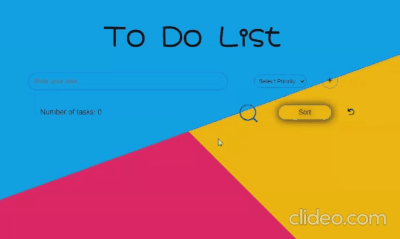

#  Pre Course Project - Todo List 📋

# Welcome to my Todo List project!

In this readme i will introduce you to my project and show you the functionalities of my website.

- link to my [repo](https://github.com/DvirYadai/Todo-List-Project/tree/AsyncAwait)

Here is a preview sample of the add and sort tasks functionality:

## How it's works.

- When you want to **add** a task you just need to write it in the **text input**, select the **priority** of the task and click on the **add** button.
- You can add as many tasks as you want!
- If you want to **delete** some task it's very simple! all you need is to click on the **trash icon** on the right side of your task and it will be deleted.
- There is **edit** option to! when you click on the **pencil** icon on the right side of your task, an edit option will open to the name and priority of the task
  and when you done editing just press the **check icon** and your done editing your task! so simple right?
- If you want to sort the tasks by their priority just click on the **sort button** and it will sort your tasks.
- Now, let's say you want to undo a delete or editing action, all you need to do is click on the **undo icon** just right to the sort button
  and it will undo your last action!
- There's even a search bar, you can search the task name or just a word from your task name, press enter and it will highlight the matches words.
  and when you want to search again just clear the search bar from the old search.
- You can also mark tasks as **done** only by pressing the checkbox on the right side of the task and of course unmark the task as well.
- Hope you will have fun, Good Luck! 🤘

## Bonuses i've done:

- jsonbin.io
- Delete + Edit a todo
- Undo action
- Search and highlight results
- Loading spinner for network request
- Mark/Unmark todo as done

Explanation about the bonuses and how they work you can find in the [How it's works](#How-it's-works.) section.

## Resources

- I've used [Google Fonts](https://fonts.google.com/) for my costume font in the website.
- For my icons i've used [Font Awesome](https://fontawesome.com/) website.
